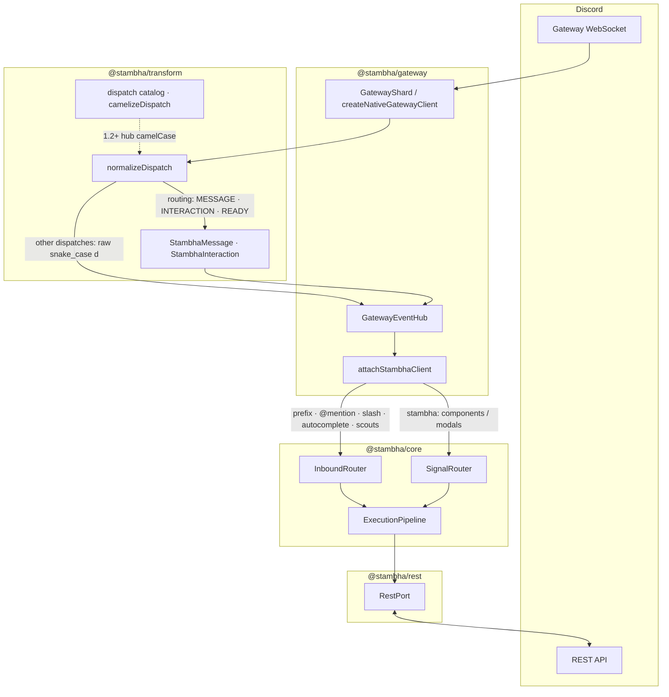

# Stambha

**Native Discord bot framework for Node.js and TypeScript**

[](https://github.com/mivaya/Stambha/blob/main/LICENSE)
[](https://nodejs.org)

Stambha is a **transport-agnostic** bot framework with a first-class **native stack** — your command pipeline, vault, and workers do not depend on a third-party Discord library. Bots use a conventional piece layout: `commands/`, `listeners/`, `gates/`, and related folders under `src/`.

Connect via `@stambha/rest`, `@stambha/gateway`, and `@stambha/transform`. See [docs/migration/](docs/migration/) if you are moving from another framework, and `examples/bot` for a full native bot.

**Extensions** (`@stambha/cache`, `@stambha/vault-sql`, `@stambha/metrics`, future dashboard/i18n) live in the separate [**Stambha-plugins**](https://github.com/Mivaya/Stambha-plugins) repo with independent versioning.

---

## Features

### Command pipeline

Piece-based architecture — commands, hooks, middleware, and post-run epilogues in a predictable pipeline.

- **Commands** — slash, prefix, `@mention`, and context menu in one `Command` class
- **Hooks** — gateway event listeners (`src/listeners/`)
- **Scouts** — passive message watchers (`src/scouts/`)
- **Barriers** — global command blockers (`src/barriers/`)
- **Gates** — per-command checks (`src/gates/`)
- **Conduits** — middleware before gates (`src/conduits/`)
- **Epilogues** — post-command hooks (`src/epilogues/`)
- **Signals** — buttons, selects, modals via `stambha:` custom ids
- **Chron** — cron scheduled tasks (`src/tasks/`)

Auto-load pieces from disk with `@stambha/loader`.

### Arguments (`@stambha/args`)

Typed prefix lexer and slash option parsing without coupling to a Discord client library.

### Gates (`@stambha/gates`)

Built-in gates: cooldown, permissions, NSFW, RunIn, guild/DM-only. Attach inline, reference by `gateNames`, or mark gate pieces `global: true`.

### Vault (`@stambha/vault`)

Typed guild, user, and member **config** (prefix, flags, modules) — Blueprint + Ledger. Use alongside Prisma/SQL for domain data; Vault is not a full ORM. See [docs/features/vault.md](docs/features/vault.md).

### Sequences

Multi-step flows with `sequence()` and `stambha:seq:` custom ids — wizards and confirmations without manual state machines.

### Native REST (`@stambha/rest`)

Centralized REST queue, rate-limit buckets, and split-tier REST worker. No Discord client library in the REST process.

### Gateway & sharding (`@stambha/gateway`)

Shard manager, identify/resume payloads, identify budget, resharding policy, gateway↔bot worker bus, `GatewayEventHub`, and `attachStambhaClient` for native WebSocket workers. **1.1.0:** `mentionCommands` for `@Bot ping` style prefix routing.

### Transform & dispatch (`@stambha/transform`)

Slim command contexts, REST payload builders, and the **dispatch module** — `normalizeDispatch` for routing-critical hub events, `GATEWAY_DISPATCH_EVENTS` catalog, and `camelizeDispatch` (foundation for camelCase hub payloads in 1.2+). Memory-conscious **desired properties** field masks for large bots.

### Tier split

Run gateway, REST, and bot logic in separate processes — see [docs/deployment/tier-split.md](docs/deployment/tier-split.md) and `examples/bot` (`pnpm split:*`).

### Metrics (`@stambha/metrics`)

Prometheus counters and histograms with optional `/metrics` HTTP server.

### Cross-runtime (`@stambha/runtime`)

Shared abstractions for Node.js, Bun, and Deno (env, fs, paths, timers).

---

## What Stambha provides

| Capability | Stambha |
|---|:---:|
| Discord coupling | **Native transport** — no library bridge layer |
| Piece / command model | **Built-in folders & registries** |
| Per-command checks | **`@stambha/gates`** |
| Settings | **Vault** (+ your ORM for domain) |
| Gateway + REST split | **`RestPort` + tier split** |
| Sharding / resharding | **`@stambha/gateway`** |
| Multi-step UI | **Sequences** |
| Mention prefix (`@Bot ping`) | **`mentionCommands` + `createMentionPrefixResolver`** |
| Gateway dispatch catalog | **`normalizeDispatch` · `camelizeDispatch` (1.1+)** |
| Observability | **`@stambha/metrics`** |

---

## Architecture



**Inbound:** `GatewayShard` receives Discord dispatches → `normalizeDispatch` in `@stambha/transform` → `GatewayEventHub.emit` (camelCase event names) → `attachStambhaClient` → `InboundRouter` / `SignalRouter` → pipeline.

**Prefix routing (1.1.0):** set `mentionCommands: true` on `attachStambhaClient`, or `createMentionPrefixResolver(botUserId)` on `client.resolvePrefix`, so `@Bot ping` routes like `!ping`.

**Outbound:** commands reply through `RestPort` (in-process `createNativeRestPort` or split-tier `HttpRestPort`).

---

## Installation

```sh
pnpm add @stambha/core @stambha/rest @stambha/gateway @stambha/transform @stambha/loader
```

Optional: `@stambha/vault`, `@stambha/vault-sql`, `@stambha/gates`, `@stambha/args`, `@stambha/metrics`, `@stambha/cache`.

Requires **Node.js 20+**.

---

## Quick start (native stack)

### 1. Command

```ts
// src/commands/General/PingCommand.ts
import { Command, ok, type CommandContext, type Registry } from "@stambha/core";

export class PingCommand extends Command {
  constructor(registry: Registry<Command>) {
    super(registry, {
      name: "ping",
      description: "Replies with Pong!",
      kinds: ["prefix"],
    });
  }

  async execute(ctx: CommandContext) {
    await ctx.reply("Pong!");
    return ok(undefined);
  }
}
```

### 2. Bootstrap

```ts
// src/main.ts
import { createStambhaBot } from "@stambha/core";
import { attachStambhaClient, createGatewayEventHub } from "@stambha/gateway";
import { loadPieces } from "@stambha/loader";
import { createNativeRestPort } from "@stambha/rest";

const token = process.env.DISCORD_TOKEN!;
const client = createStambhaBot({
  prefix: "!",
  restPort: createNativeRestPort(token),
});

await loadPieces(client);

const hub = createGatewayEventHub();
attachStambhaClient(hub, client, {
  mentionCommands: true, // @Bot ping — uses bot user id from gateway ready
});
client.setBridge(hub);

hub.markReady({ user: { id: "YOUR_BOT_USER_ID" } });
await client.start();

// Your WebSocket shard worker feeds events, e.g.:
// hub.emit("messageCreate", { id, content, channelId, guildId, author: { id, bot: false } });
```

### 3. Tier split (production)

```bash
cd examples/bot
pnpm rest    # REST worker
pnpm bot     # bot worker
pnpm gateway # gateway relay (native hub)
```

---

## Project layout

```text
src/
  commands/       # slash, prefix, context menu
  listeners/      # Hook pieces
  gates/          # Gate pieces
  scouts/         # passive watchers
  barriers/       # global blockers
  epilogues/      # post-command hooks
  conduits/       # middleware
  signals/        # buttons, modals, selects
  tasks/          # Chron cron jobs
  schemas/        # Vault blueprints
  main.ts
```

Full mapping: [docs/guide/project-structure.md](docs/guide/project-structure.md).

---

## Packages

Published under the [**@stambha** npm org](https://www.npmjs.com/org/stambha). Each package has its own README with install steps and examples.

| Package | Description |
|---------|-------------|
| [`@stambha/core`](packages/core) | Client, pipeline, registries, sequences, chron |
| [`@stambha/rest`](packages/rest) | **Native REST** client + worker |
| [`@stambha/gateway`](packages/gateway) | **Native gateway** hub, sharding, worker bus |
| [`@stambha/transform`](packages/transform) | Dispatch normalization, Stambha shapes, REST contexts |
| [`@stambha/transport`](packages/transport) | API constants, session, rate-limit routes |
| [`@stambha/loader`](packages/loader) | Auto-load piece folders |
| [`@stambha/gates`](packages/gates) | Built-in gates |
| [`@stambha/args`](packages/args) | Argument parsing |
| [`@stambha/plugins`](packages/plugins) | Plugin lifecycle and DI container |
| [`@stambha/vault`](packages/vault) | Settings persistence |
| [`@stambha/runtime`](packages/runtime) | Node / Bun / Deno helpers |

**Extensions** ([Stambha-plugins](https://github.com/Mivaya/Stambha-plugins)): `@stambha/cache`, `@stambha/metrics`, `@stambha/vault-sql`, future `@stambha/dashboard`.

---

## Examples

| Example | Stack |
|---------|--------|
| [`examples/bot`](examples/bot) | Full piece-based layout — commands, gates, vault, signals, … |
| [`examples/minimal`](examples/minimal) | MockBridge + unit-style invoke |

See [`examples/README.md`](examples/README.md) for run instructions.

---

## Documentation

**Community site:** run `pnpm docs:dev` and open the VitePress preview, or read markdown under [`docs/`](docs/).

Deploy to GitHub Pages: see [Hosting the docs](docs/guide/hosting-the-docs.md).

| Section | Topic |
|---------|-------|
| [Getting started](docs/guide/getting-started.md) | Install and first bot |
| [Features](docs/features/gates.md) | Gates, vault, sequences, … |
| [Deployment](docs/deployment/overview.md) | Tier split, gateway, metrics |
| [Migration](docs/migration/) | Guides for moving from other bot stacks |

**Contributing:** [.github/CONTRIBUTING.md](.github/CONTRIBUTING.md) · [AGENT.md](AGENT.md) (architecture & agent conventions)
---

## Status

**v1.1.0** — Mention-prefix commands and gateway dispatch foundation ([CHANGELOG](CHANGELOG.md)). Additive minor: `mentionCommands`, `createMentionPrefixResolver`, dispatch catalog + `camelizeDispatch` (hub camelCase migration lands in **1.2.0**).

### Semver (from 1.0.0)

| Release | Policy |
|---------|--------|
| **1.0.0+** | Breaking changes only in **major** versions |
| **Minor** | New features, backward compatible |
| **Patch** | Bug fixes, backward compatible |

Documented gaps and 1.2.0 preview: [Known gaps](docs/guide/known-gaps.md).
