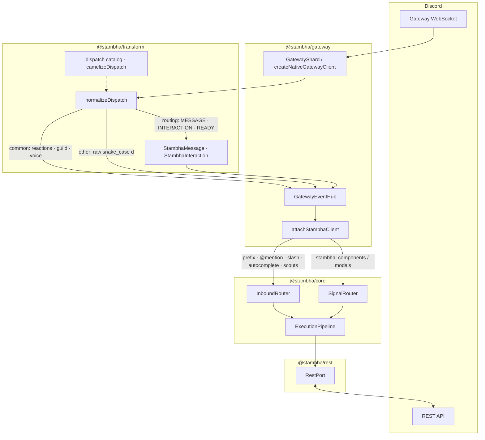

# Architecture

How events move through Stambha’s native stack. For product benefits, see [Why Stambha](/guide/why-stambha). For a first bot, see [Getting started](/guide/getting-started).

## Stack

```text
@stambha/gateway   →  WebSocket shards, GatewayEventHub, attachStambhaClient
@stambha/transform →  normalizeDispatch, StambhaMessage / StambhaInteraction
@stambha/core      →  InboundRouter, SignalRouter, ExecutionPipeline
@stambha/rest      →  RestPort (replies, deploy, optional REST worker)
```

Core never imports discord.js or Discordeno. Commands and pieces talk to Stambha APIs only.

## Event flow



**Inbound:** `GatewayShard` receives Discord dispatches → `normalizeDispatch` in `@stambha/transform` → `GatewayEventHub.emit` (camelCase event names) → `attachStambhaClient` → `InboundRouter` / `SignalRouter` → pipeline.

**Outbound:** commands reply through `RestPort` (in-process `createNativeRestPort` or split-tier `HttpRestPort`).

## Routing today

| Hub event | Payload |
|-----------|---------|
| `messageCreate` / `messageUpdate` | Slim `StambhaMessage` |
| `interactionCreate` | `StambhaInteraction` (slash, autocomplete, components, modals) |
| `ready` | Ready DTO (user id for `mentionCommands`) |
| Reactions, guild/member, voice, message delete, … | CamelCase structural payloads (`guildId`, `userId`, …) |
| Remaining dispatches | CamelCase **event names**; raw snake_case `d` |

Prefix routing: `mentionCommands: true` on `attachStambhaClient`, or `createMentionPrefixResolver(botUserId)` on `client.resolvePrefix`, so `@Bot ping` routes like `!ping`.

Optional escape hatch: `dispatchNormalize: 'raw'` on `createNativeGatewayClient` keeps wire snake_case on those common events while migrating listeners. See [Gateway](/deployment/gateway).

## Pipeline

```text
Scout → InboundRouter → Conduit → Barrier → Gate → Command → Epilogue
Signals (buttons / selects / modals) route in parallel on interactionCreate
```

## One process vs split processes

| Shape | When |
|-------|------|
| **One process** | Gateway + REST + bot together — default for new bots |
| **Split processes** | Separate gateway, REST, and bot workers — large bots, shared rate limits |

Same pieces and pipeline in both shapes. See [Tier split](/deployment/tier-split) and [Gateway](/deployment/gateway).

## Related

- [Deployment overview](/deployment/overview)
- [Gateway](/deployment/gateway) — attach options and dispatch normalization
- [Transport reference](/reference/transport)
