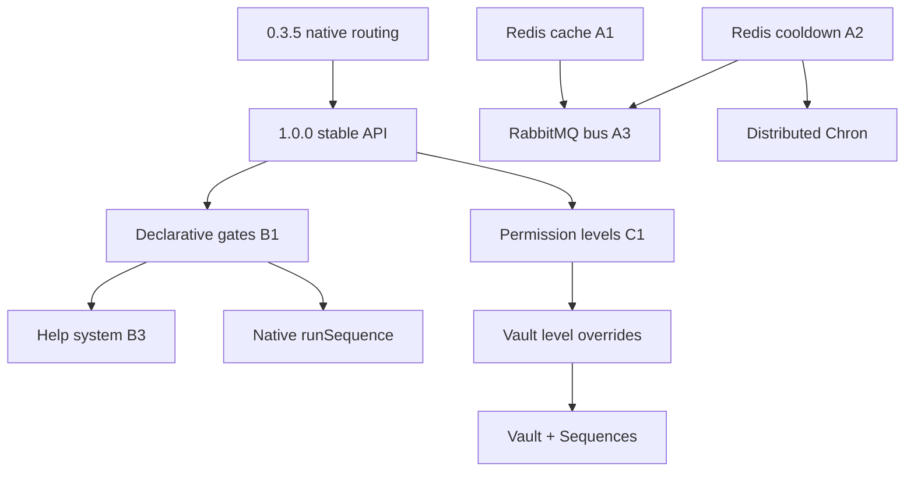

# Future release plan (1.x / 2.0)

Long-term pillars **after** the native stack stabilizes at **1.0.0**. Near-term release lanes (0.3.5, 1.0.0) live in [release-plan.md](./release-plan.md).

**Scope:** Enhancements and scale — **not** blockers for a basic native bot once **0.3.5** ships.

**Last updated:** 2026-06-15

---

## Goals

1. **Scale like Discordeno** — shared state and messaging across gateway / REST / bot workers.
2. **DX like Sapphire** — declare command behavior in options; gates wire automatically.
3. **Governance** — numeric permission levels with guild overrides.
4. **Stambha-only** — Vault + Sequences + split tier in one native stack.

---

## Release sequencing (full picture)

```text
0.3.4  ✅ Rich replies, REST helpers, mention args
0.3.5  🔲 Native interaction routing (options, meta, signals, autocomplete, defer)
1.0.0  🔲 Stable semver API + documented known gaps
1.x    🔲 B1 declarative gates, C1 levels, A1–A2 Redis, B3 help, B2 REST resolvers
2.0.0  🔲 A3 bus, native runSequence, distributed chron/cooldown
```

### Dependency graph



---

## Pillar A — Distributed infrastructure

Today: in-memory cache (`@stambha/cache`), in-memory cooldown store, HTTP worker bus. Native WS gateway **done** (0.3.0, ex-A5).

| Component | Purpose | Package | When |
|-----------|---------|---------|------|
| **Redis cache** | Shared guild/user cache across workers | `@stambha/cache-redis` | 1.x A1 |
| **Redis cooldown store** | Shared rate limits in split tier | `@stambha/gates` + driver | 1.x A2 |
| **Redis Vault driver** | Optional shared settings | `@stambha/vault-redis` | 1.x |
| **Message bus (RabbitMQ)** | Gateway → bot fan-out at scale | `@stambha/bus` | 2.0 A3 |
| **InfluxDB telemetry** | Gateway identify, REST 429s | `@stambha/metrics-influx` | 1.x A4 |
| ~~Native WebSocket gateway~~ | ~~Custom hub.emit~~ | `@stambha/gateway` | ✅ 0.3.0 |

**Design rule:** every backend implements a **core interface** (`Cache`, `CooldownStore`, `WorkerBus`) so monolith bots keep memory defaults.

---

## Pillar B — Sapphire-style command options

Today: gates work via manual `gateNames` / inline gates. **Declarative options on `Command` are 1.x**, not 0.3.x.

| Sapphire option | Stambha today | Target |
|-----------------|---------------|--------|
| Cooldown / permissions / nsfw / runIn | Manual gates | Auto-gate from `CommandOptions` (B1) |
| `preconditions` | `gates: [...]` | Alias + registry (B1) |
| `description` | **Done** | — |
| `detailedDescription`, `fullCategory` | Partial | B3 help |
| Prefix flags / options / quotes | Partial lexer | B2 |
| REST entity arg resolvers | Mention ids only (0.3.4) | B2 |
| `typing` | Missing | 1.x |
| Slash permissions / dmPermission | **Done** deploy | — |

**B1** (`feature/declarative-gates`): `resolveCommandGates(command)` merges options + explicit `gates[]`.

**B2** (`feature/rest-arg-resolvers`): `fetchUser`-backed resolvers + prefix flags.

**B3** (`feature/help-system`): `@stambha/help` using categories and `detailedDescription`.

---

## Pillar C — Permission levels

Numeric levels (Everyone → Moderator → Admin → Owner) without discord.js.

| Phase | Branch | Deliverable |
|-------|--------|-------------|
| C1 | `feature/permission-levels` | `@stambha/levels` + `permissionLevelGate` |
| C2 | `feature/levels-vault` | Guild member level ledger + admin commands |

Vault stores per-guild overrides ([ADR 004](./adr/004-vault-scope-orm-coexistence.md)).

---

## Pillar E — Dashboard HTTP API (`@stambha/dashboard`)

**Repo:** [Stambha-plugins](https://github.com/Mivaya/Stambha-plugins) ([ADR 003](./adr/003-plugins-monorepo.md)) — not core.

Today Stambha has **operator** HTTP only (REST worker, gateway relay, reshard, metrics). No OAuth dashboard routes.

Target: `@stambha/dashboard` — HTTP + Discord OAuth + Vault CRUD for a user-built frontend.

Phases E1–E4: router, OAuth, Vault routes, tier-split mount. Depends on Vault (done) + C1 for admin route locking.

---

## Pillar D — Stambha-only (2.0 focus)

| Feature | Why unique | When |
|---------|------------|------|
| **Native `runSequence`** | Multi-step UI without bridge-tied flow | 2.0 |
| **Distributed Chron** | One cron tick cluster-wide | 2.0 |
| **Declarative gates + split tier** | Sapphire DX at Discordeno scale | 1.x B1 + A2 |
| **Reshard-aware routing** | `Barrier` during resharding | 1.x / gateway |
| **Vault + Sequences** | Wizards persist to schema | 2.0 |
| **Observability bundle** | Prometheus + optional Influx + epilogues | 1.x A4 |

### Highest-impact originals (post-1.0)

1. **Native `runSequence`** — biggest remaining UX gap after 0.3.5.
2. **Distributed cooldown + Chron** — honest multi-worker production.
3. **Vault-driven guild config** — prefix, flags, level overrides (C2).
4. **Reshard barrier** — operational safety for large bots.

---

## Explicit non-goals

- Re-introducing `@stambha/bridge-*` packages
- Sapphire plugin compatibility or `@stambha/plugin-*` names in core
- Bundling official extensions in core monorepo
- Requiring Redis/RabbitMQ for single-process bots
- Vault as full ORM

---

## Open questions

1. **Package naming:** `@stambha/bus-rabbit` vs optional deps in `@stambha/gateway`?
2. **Permission levels default ladder:** Fixed numeric vs permission-bit derived?
3. **Influx vs Prometheus:** Dual export or gateway-only Influx?
4. **2.0 breaking changes:** Auto-gates merge order with manual `gates[]`?
5. **Plugins org/repo name:** `Mivaya/Stambha-plugins` — settled for extensions.

---

## Official extensions (plugins repo)

| Package | Purpose |
|---------|---------|
| `@stambha/dashboard` | HTTP + OAuth + Vault routes (Pillar E) |
| `@stambha/cache`, `@stambha/metrics`, `@stambha/vault-sql` | Already published from plugins repo |
| `@stambha/i18n` | Locale / help translation |
| `@stambha/dev-reload` | Dev piece hot reload |

**Core keeps:** `@stambha/plugins` (host only).

---

## Related

- [release-plan.md](./release-plan.md) — 0.3.5 and 1.0.0 gates
- [roadmap.md](./roadmap.md) — feature matrix
- [migration-shims.md](./migration-shims.md) — app-layer patterns to delete
- [phases.md](./phases.md) — completed phases 1–22
